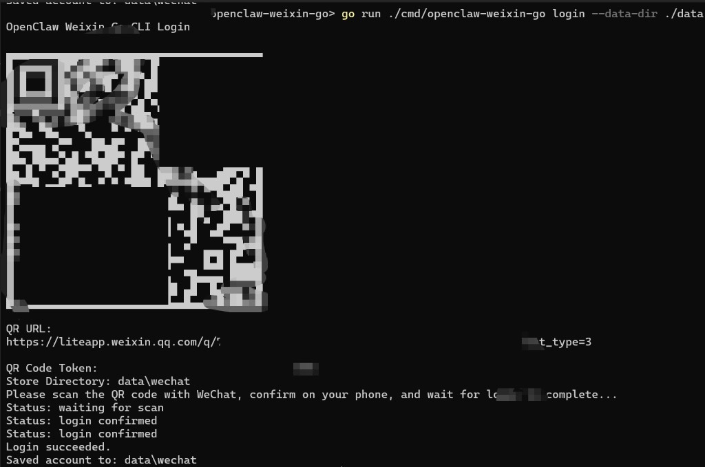

# openclaw-weixin-go

[](./go.mod)
[](./LICENSE)

[中文 README](./README.md)

`openclaw-weixin-go` is a WeChat iLink protocol SDK for Go developers. It packages QR login, long-polling message flow, and default local persistence into a reusable pure Go toolkit that can be integrated directly into standalone projects.

Core capabilities:

- QR login and QR status polling
- `getupdates` long-polling message retrieval
- Text message sending and typing indicator support
- Default local persistence: `account.json`, `ctx_tokens.json`, `sync_buf.txt`
- A ready-to-use CLI: `login`, `whoami`, `poll`, `send`, `logout`

Author: `jtai Team (曾能混&tang先森)`  
Email: `jwhna1@gmil.com`  
Website: [jtai.cc](https://jtai.cc)

## Project Positioning

This repository is not an official Tencent Go SDK.

The protocol behavior and field mapping are implemented with reference to [Tencent/openclaw-weixin](https://github.com/Tencent/openclaw-weixin). The goal is to provide the Go ecosystem with a standalone WeChat protocol SDK that is easier to integrate, easier to extend, and suitable for direct use in independent projects.

## Structure

- `client/`: iLink protocol client and DTOs
- `store/`: default file-based persistence
- `cmd/openclaw-weixin-go/`: CLI entrypoint
- `examples/echo-bot/`: minimal polling example

## Install

```bash
go build ./cmd/openclaw-weixin-go
```

## CLI Commands

```bash
openclaw-weixin-go login  --data-dir ./data
openclaw-weixin-go whoami --data-dir ./data
openclaw-weixin-go poll   --data-dir ./data
openclaw-weixin-go send   --data-dir ./data --to wxid_xxx --text "hello"
openclaw-weixin-go logout --data-dir ./data
```

`login` renders a scannable QR code directly in the terminal, prints the QR URL and polling status, and saves login data to the local data directory after success.

## Quick Start

Recommended minimal verification flow:

```bash
go run ./cmd/openclaw-weixin-go login --data-dir ./data
go run ./cmd/openclaw-weixin-go whoami --data-dir ./data
go run ./cmd/openclaw-weixin-go poll --data-dir ./data
```

What each step does:

- `login`: shows a terminal QR code and prints statuses such as `waiting for scan`, `scanned, please confirm on your phone`, and `login confirmed`
- After successful login, account data is stored at `./data/wechat/account.json`
- `whoami`: verifies that `account.json` has been written successfully
- `poll`: verifies that `getupdates` long-polling is working

Sanitized CLI login demo screenshot:



## SDK Usage

```go
package main

import (
    "context"

    "github.com/jwhna1/openclaw-weixin-go/client"
    "github.com/jwhna1/openclaw-weixin-go/store"
)

func main() {
    st := store.NewFileStore("./data")
    acct, _ := st.LoadAccount()

    cli := client.New(client.Options{
        BaseURL:        acct.BaseURL,
        ClientIDPrefix: "my_bot",
    })

    resp, _ := cli.GetUpdates(context.Background(), acct.Token, "", client.DefaultGetUpdatesTimeout)
    _ = resp
}
```

## Current Scope

Currently supported:

- QR login
- Text message sending
- Long-polling message retrieval
- `context_token` persistence
- `sync_buf` persistence

Not promised in the current version:

- Media upload and download
- Advanced multi-account scheduling
- Full gateway-level integration

## Open Source and Disclaimer

- Please do not describe this repository as an official Tencent SDK.
- This project is released under the `MIT` license.
- The software is provided `AS IS`, without any express or implied warranty. Any risks or liabilities arising from use, modification, or redistribution are the responsibility of the user.
- Protocol behavior should follow verified real-world responses first, rather than unverified legacy documentation.

## Related Resources

- [OpenClaw Official Documentation](https://docs.openclaw.ai/)
- [Tencent official npm package `@tencent-weixin/openclaw-weixin`](https://www.npmjs.com/package/@tencent-weixin/openclaw-weixin)
